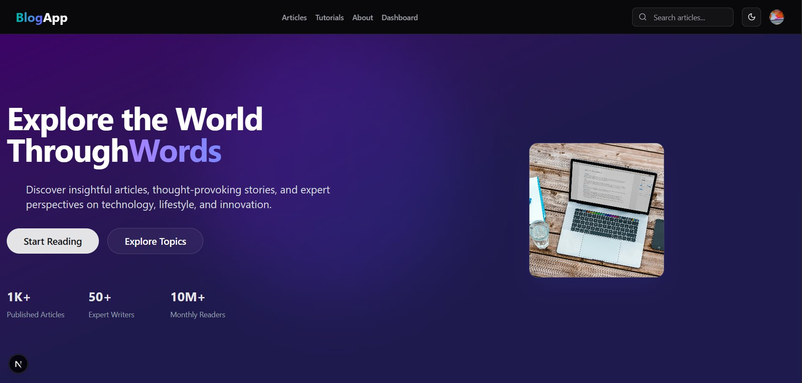
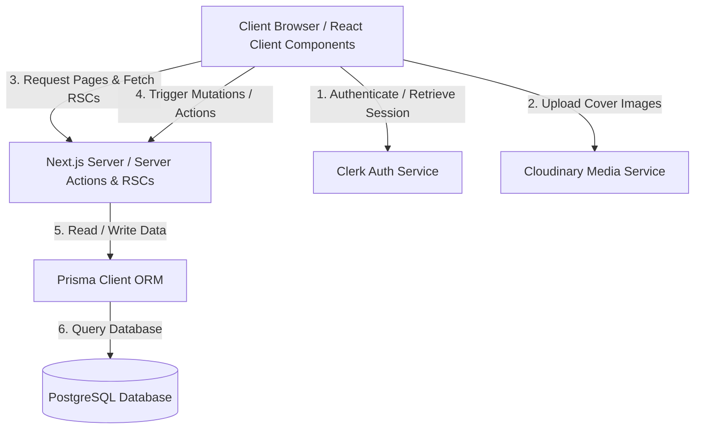
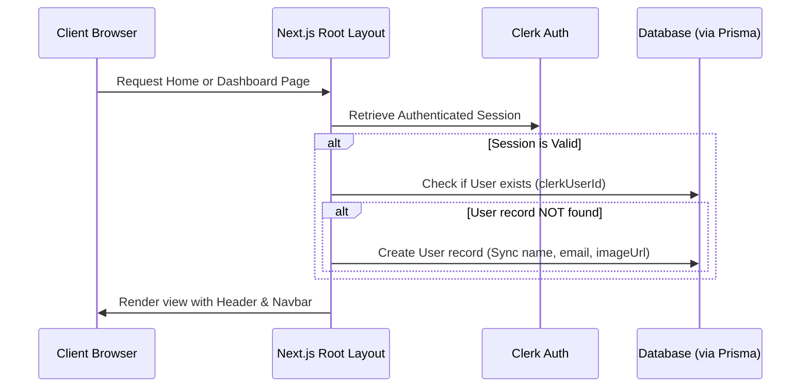

# 🖊️ BitWrite

**BitWrite** is a premier, full-stack blogging platform and social network built for modern software engineers, developers, and tech writers. It provides an elegant space for technical writers to publish articles using a rich-text editor, build an audience, connect with other developers, and save resources for continuous learning.



---

## 🚀 Features

-   **🔐 Secure User Authentication**: Managed via [Clerk](https://clerk.com/), supporting fast sign-ups, sign-ins, and secure session management.
-   **✍️ Rich Text Blog Editor**: Immersive writing experience powered by [Tiptap](https://tiptap.dev/) with support for headings, bold/italic, code blocks, lists, dynamic character counting, and emoji support.
-   **🖼️ Image Hosting & Optimization**: Integration with [Cloudinary](https://cloudinary.com/) for fast, responsive, and secure featured image uploads.
-   **💬 Engagement Loop**: Interactive interface enabling users to:
    -   Like and unlike articles.
    -   Leave nested comments on articles.
    -   Bookmark articles to personal reading lists.
-   **👥 Developer Profiles & Connections**:
    -   Customized user profile views displaying the author's biography.
    -   Social media links (GitHub, Twitter, LinkedIn, etc.) integration.
    -   Follow/unfollow system to build writer networks.
-   **📊 Dedicated Dashboard**: A personal command center for writers to manage their published articles, saved bookmarks, and social connections (followers & following).
-   **🔍 Dynamic Search & Filtering**: Search articles instantly by title or content, or explore articles via categories and tags.
-   **🌓 Responsive Theme Switching**: Seamless dark and light mode support with [Next-Themes](https://github.com/pacocoursey/next-themes) and styled with [Tailwind CSS](https://tailwindcss.com/).
-   **📈 SEO & Open Graph Images**: Full search-engine optimization with the Next.js Metadata API and dynamic Open Graph (`opengraph-image.tsx`) generation for rich social media link previews.

---

## 🏗️ System Design Architecture

BitWrite is designed with a modern server-first architecture using Next.js 15. Data fetching is processed on the server using React Server Components, and data mutations are executed via React Server Actions.


```mermaid
graph TD
    Client[Client Browser / React Client Components]
    NextServer[Next.js Server / Server Actions & RSCs]
    Clerk[Clerk Auth Service]
    Cloudinary[Cloudinary Media Service]
    Postgres[(PostgreSQL Database)]
    Prisma[Prisma Client ORM]

    Client -->|1. Authenticate / Retrieve Session| Clerk
    Client -->|2. Upload Cover Images| Cloudinary
    Client -->|3. Request Pages & Fetch RSCs| NextServer
    Client -->|4. Trigger Mutations / Actions| NextServer
    NextServer -->|5. Read / Write Data| Prisma
    Prisma -->|6. Query Database| Postgres
```

### Database Schema Entity Relationship
The PostgreSQL database (managed via Prisma ORM) is composed of the following schemas:
*   **User**: Central profile registry syncing email, avatar, and bio details.
*   **Follow**: Join model representing a follower-following relationship between users.
*   **SocialLink**: Associated social media links for developer profiles.
*   **Article**: Blogs containing title, HTML content, tags, category, and cover image.
*   **Comment**: Interactive replies left on articles.
*   **Like**: Record of user engagement on articles.
*   **Bookmark**: Reading list association linking users to saved articles.

---

## 🔄 Core Workflows

### 1. Just-In-Time (JIT) User Synchronization
To maintain a local profile database without the overhead of Clerk Webhooks, BitWrite utilizes a JIT check in the Next.js Root Layout page.


```mermaid
sequenceDiagram
    participant User as Client Browser
    participant App as Next.js Root Layout
    participant Clerk as Clerk Auth
    participant DB as Database (via Prisma)

    User->>App: Request Home or Dashboard Page
    App->>Clerk: Retrieve Authenticated Session
    alt Session is Valid
        App->>DB: Check if User exists (clerkUserId)
        alt User record NOT found
            App->>DB: Create User record (Sync name, email, imageUrl)
        end
    end
    App->>User: Render view with Header & Navbar
```

### 2. Article Publishing Flow
1.  **Drafting**: The writer inputs content into the rich Tiptap editor.
2.  **Upload**: When a cover image is attached, it is uploaded directly to Cloudinary, returning a secure URL.
3.  **Submission**: The form triggers the `create-article` Server Action, validating parameters using `Zod`.
4.  **Database Write**: The database creates the `Article` record linked to the authenticated author.
5.  **Revalidation**: `revalidatePath` runs on the server, refreshing public article feeds instantly.

### 3. Engagement & Actions Loop
1.  User clicks **Like**, **Bookmark**, **Follow**, or writes a **Comment**.
2.  Interactive client component triggers the corresponding Server Action (`like-toggle.ts`, `bookmark-article.ts`, `followUser.ts`, or `create-comment.ts`).
3.  Prisma executes the database operation (creating, toggling, or removing rows).
4.  Next.js triggers router state refresh, re-fetching the updated status and updating the UI instantly without full page reloads.

---

## 🛠️ Technology Stack

| Technology | Role / Purpose | Version |
| :--- | :--- | :--- |
| **Next.js** | React Framework (App Router, Turbopack, Server Actions) | `^15.5.20` |
| **TypeScript** | Type-safe programming language | `^5` |
| **Prisma** | Next-generation Node.js and TypeScript ORM | `^6.8.2` |
| **PostgreSQL** | Relational Database for persistent storage | - |
| **Clerk** | Secure identity management and user authentication | `^6.20.2` |
| **Cloudinary** | Media storage and optimization platform | `^2.6.1` / `^6.16.0` |
| **Tiptap** | Headless rich-text editor framework | `^3.27.1` |
| **Tailwind CSS** | Styling engine for layout and custom UI components | `^4` |
| **Shadcn UI** | Accessible Tailwind UI components (built on Radix UI) | - |
| **Zod** | Type-safe schema validation | `^3.25.49` |

---

## 🏁 Getting Started

Follow these steps to set up and run a copy of BitWrite on your local machine for development and testing.

### Prerequisites
Make sure you have the following installed:
-   **Node.js** (v20 or later)
-   **npm** or **yarn**
-   A running instance of a **PostgreSQL** database
-   Accounts on **Clerk** and **Cloudinary**

### Installation

1.  **Clone the repository:**
    ```bash
    git clone https://github.com/Sandeep-singh-99/blog_app.git
    cd blog_app
    ```

2.  **Install project dependencies:**
    ```bash
    npm install
    ```

3.  **Configure environment variables:**
    Create a `.env` file in the root directory and configure the environment variables as follows:
    ```env
    # Prisma Database URL
    DATABASE_URL="postgresql://<USER>:<PASSWORD>@<HOST>:<PORT>/<DATABASE>?schema=public"

    # Clerk Authentication
    NEXT_PUBLIC_CLERK_PUBLISHABLE_KEY=your_clerk_publishable_key
    CLERK_SECRET_KEY=your_clerk_secret_key
    NEXT_PUBLIC_CLERK_SIGN_IN_URL=/sign-in
    NEXT_PUBLIC_CLERK_SIGN_UP_URL=/sign-up
    NEXT_PUBLIC_CLERK_AFTER_SIGN_IN_URL=/
    NEXT_PUBLIC_CLERK_AFTER_SIGN_UP_URL=/

    # Cloudinary Integration
    NEXT_PUBLIC_CLOUDINARY_CLOUD_NAME=your_cloudinary_cloud_name
    NEXT_PUBLIC_CLOUDINARY_API_KEY=your_cloudinary_api_key
    CLOUDINARY_API_SECRET=your_cloudinary_api_secret
    ```

4.  **Synchronize the database schema:**
    Run Prisma migrations to generate the local Prisma Client and initialize your database tables:
    ```bash
    npx prisma migrate dev
    ```

5.  **Run the local development server:**
    ```bash
    npm run dev
    ```

Open [http://localhost:3000](http://localhost:3000) in your browser to view the application.

